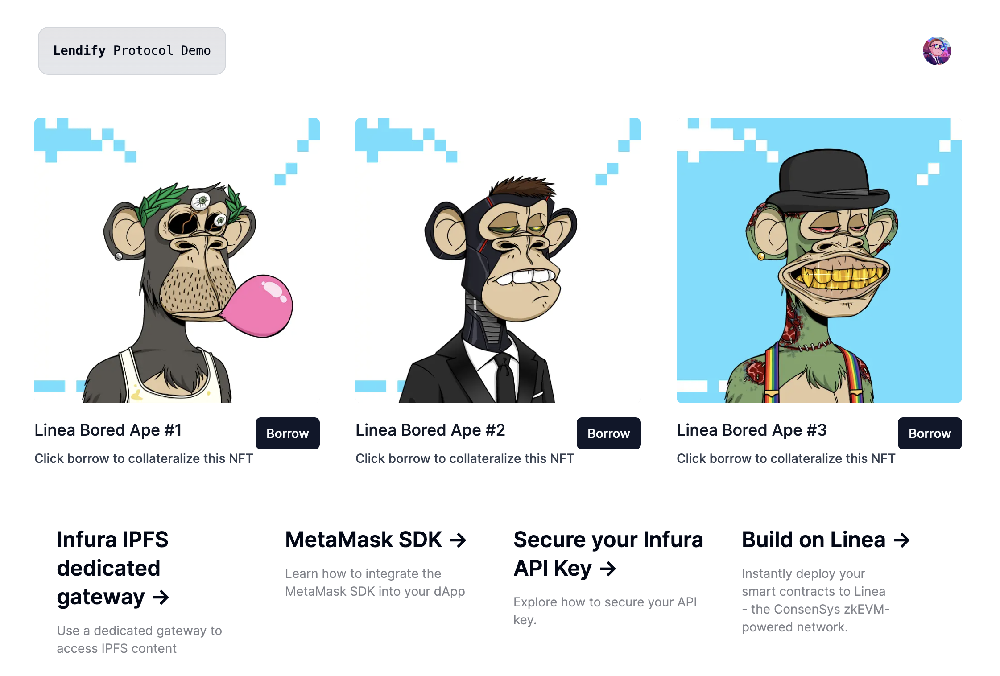

## LendifyProtocol

A simple lending & borrowing protocol where end-users can collateralize NFTs to borrow a fixed USDC loan amount.



## Dependencies

This project is built upon the Consensys product suite such as [Infura](https://www.infura.io/) and [MetaMask SDK](https://docs.metamask.io/wallet/how-to/use-sdk/). In order to run it, several configurations are required.

Create a `.env` file using the `.env.example` file provided in this folder and update all variables accordingly:

- `NEXT_PUBLIC_INFURA_DEDICATED_IPFS_GATEWAY` is an optional dedicated IPFS gateway to retrieve the NFTs metadata. To learn more please follow [this link](https://docs.infura.io/api/networks/ipfs/how-to/access-ipfs-content/dedicated-gateways).
- `NEXT_PUBLIC_INFURA_API_KEY` is mandatory to make API calls through the MetaMask SDK. To learn more please follow [this guide](https://docs.infura.io/api/getting-started).

## Getting Started

First, install all dependencies:

```
npm install
```

After, run the development server:

```
npm run dev
```

Open [http://localhost:3000](http://localhost:3000) with your browser to see the result.

You can start editing the page by modifying `app/page.tsx`. The page auto-updates as you edit the file.

## Other dependencies

This project uses [`next/font`](https://nextjs.org/docs/basic-features/font-optimization) to automatically optimize and load Inter, a custom Google Font, [`shadcn-ui`](https://ui.shadcn.com/) for styling and [`tailwindui`](https://tailwindui.com/).
